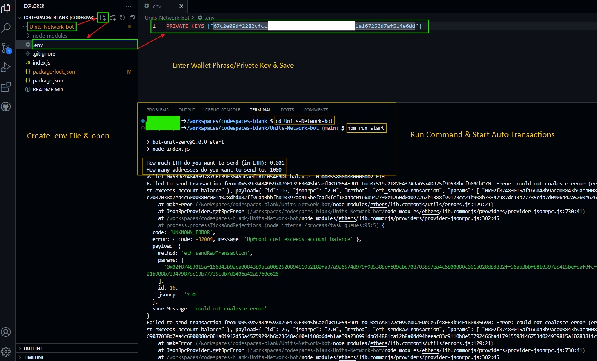

# Unichain Testnet Daily Transaction Bot

## Prerequisites
- Must need to have $ETH on Unichain
   - You can get Unichain $ETH using faucet from [here](https://console.optimism.io/faucet) or by bridging using [superbridge](https://superbridge.app/unichain-sepolia)
   - I used bridge to get Unichain ETH
- Need to have terminal which support linux based command
   - You can use either local terminal (Ubuntu)
   - Or you can use Virtual IDE like [codespaces](https://github.com/codespaces)

### 1 .Open [VsCode](https://code.visualstudio.com/download) OR [Github CodeSpace](https://github.com/codespaces)

## Steps

### 2. Clone Repository

```bash
git clone https://github.com/BidyutRoy2/Unichain-Testnet-Bot.git
```

```
cd Unichain-Testnet-Bot
```

### 3. Instal Dependency

```bash
npm install
```

### 4. configurate .env File

Create a file named .env in the project root directory.

```bash
 .env
```

<p align="center">

</p>


```bash
PRIVATE_KEYS=["Enter-Wallet-Private-Key"]
```

### 5. Run script & Make Daily Transaction

```bash
npm run start
```


<h2 align=center> Deploy ERC20 Token Contract on Unichain Sepolia </h2>

 
## Installation
- You can use either this command
```bash
  [ -f "DeployContract.sh" ] && rm DeployContract.sh; wget -q https://raw.githubusercontent.com/BidyutRoy2/Unichain-Testnet-Bot/refs/heads/main/DeployContract.sh && chmod +x DeployContract.sh && ./DeployContract.sh
```
- Or this command to run this script
```bash
[ -f "DeployContract.sh" ] && rm DeployContract.sh; curl -sSL -o DeployContract.sh https://raw.githubusercontent.com/BidyutRoy2/Unichain-Testnet-Bot/refs/heads/main/DeployContract.sh && chmod +x DeployContract.sh && ./DeployContract.sh
```


# ▄︻デ𝙂𝙚𝙩 𝙇𝙖𝙩𝙚𝙨𝙩 𝘼𝙞𝙧𝙙𝙧𝙤𝙥𝙨 & 𝙐𝙥𝙙𝙖𝙩𝙚𝙨═━一

### ▄︻デ𝙅𝙤𝙞𝙣 𝙏𝙚𝙡𝙚𝙜𝙧𝙖𝙢═━一 [🎀  𝐻𝒾𝒹𝒹𝑒𝓃 𝒢𝑒𝓂  🎀](https://t.me/hiddengemnews) 

### ░▒▓█►─═  𝓗𝓲𝒹ᗪ𝓔η Ǥέ𝕄 ═─◄█▓▒░
